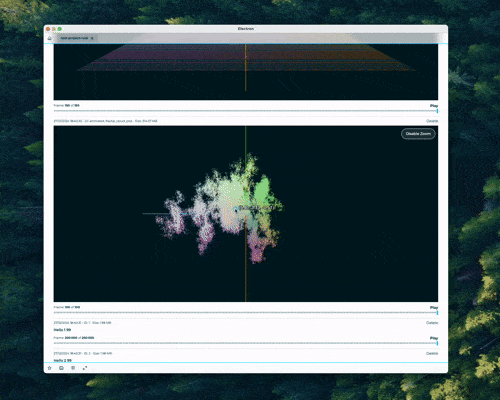
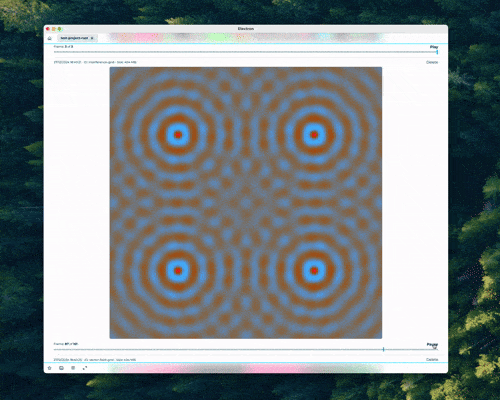
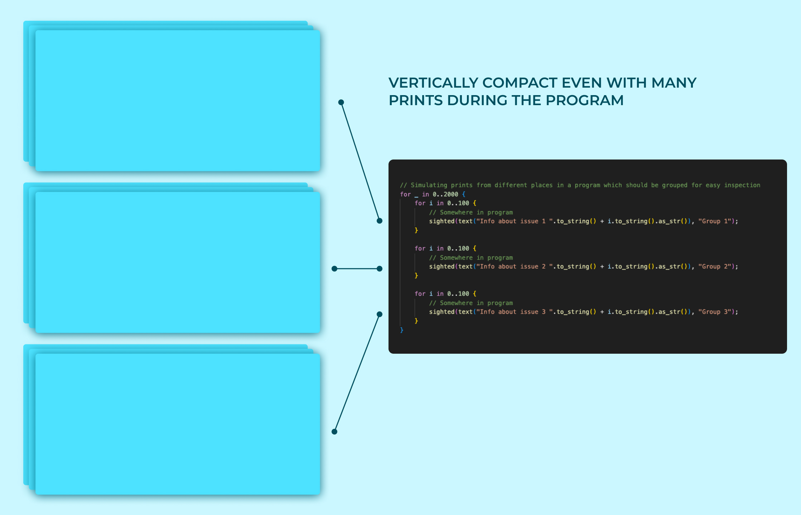

# SIGHTED - Print Debugging on Steroids

## Soon to be released

### Print data and visualizations in one place from any programming language.


Sighted is a project that will allow data, texts and plots of different kinds to be printed/plotted easily and performant from any language.

In Sighted, the term **"print"** is used a bit differently then normal. Here, print is a generic verb for showing data of any kind. Texts, Errors, 3d-plots, Heatmaps, Tables etc.

## Who is this tool for?

- **Coders that print to troubleshoot problems**
- **Coders that want the best solution of visualizing computations with interactive plots, and doing so from any language, not just Python**
- **Coders who would like to easily review prints from the execution, even if there are millions, without having a cluttered scrolling nightmare**
- **Coders that want their prints and plots the be stored, indexed, managed**
- **Coders that would like to easily share prints/plots/logs/errors just by sharing a single file**

## Features

- **Can Work With Any Programming Language**
- **Live Monitoring of Prints During Heavy Computations**
- **Custom Data Protocol to Efficiently Send Data From Any Language.**
- **Persistently Stores and Manages Data From Prints**
- **GPU-Accelerated Prints For Super Fast Complex Visualizations**
- **Format to Efficiently Share Prints With Others**

<p float="left">
  
  
  
</p>

## Installation

1. Download the Sighted app (when available)
2. Install the Sighted library for your language
3. Add the functions "sighted_setup" and "sighted_wait" to your code.
4. Print from anywhere between these, including different threads.

## Sighted user logic (Quick intuition tutorial)

1. **"sighted_setup(...)"** connects your program to the Sighted app. This must thus be run before you can do any prints.
2. **"sighted_wait()"** makes sure all the prints is finished or else will wait for them.
3. **"sighted(...)"** is the generic function to print any data. This is like the regular **"print(...)"** but can take more types of data and is obvious to use the sighted system.
4. **"text(...)"**, **"grid(...)"**, **"lines(...)"**, **"points3d(...)"** etc, are what you put inside the **"sighted(...)"** function. These act like helper functions to bundle your data (of respective type) in the correct manner for the sighted pipeline. Think of it like this **"sighted(lines(YOUR LINES DATA), "")"** to print lines or **"sighted(points3d(YOUR POINTS DATA), "")"** to print your 3d-points data.

## Fundamental Concepts

### Projects

Sighted app is a single place for the output of all your projects. Therefore, when you initialize Sighted for your project, you give a "project name" for in which your prints will be contained.

### Timeline

In a project, prints are stored "softly chronological"[1] in a vertical timeline, similar to how it is in a chatbot like ChatGPT. You scroll up to see history.

### Groups

<p float="left">


</p>

Often times, prints belong together. It can be error messages from a certain function, state snapshots from a loop or different time frames from a calculation. These can be viewed together in place by providing a GROUP_ID to the print, like this:

```rust
// Print 3d-points
for i in 0..num_frames {
  let points = // Do calculations for the frame this time step

  // Print the points for the frame with a GROUP_ID, 
  // then the points printed form the coming iterations in the simulation will also have this ID and they will be grouped and played like an animation in the app.
  sighted(points3d(&points), "fluid-simulation");
}

```

### Sharing

When your project outputs prints, the app will store them to disk and index them. This creates a folder with binary files on your computer. By sharing this folder, you can easily give it to someone else for inspection without they having to recalculate any of the data.

This is very useful if errors are found which might be hard to reproduce, and you want to share your captured timeline of prints with your coworkers. Or maybe if you are working on a heavy physics simulation that takes hours to rerun, then you can share your prints to others so they can interact with the produced print without having to rerun the simulation.

### Simple uses in Rust and Python

```rust
// Example in rust
fn main() {
  //You can print in your program between the setup and wait functions.
  //If you put these as start and end in your program, you can print from anywhere.
  sighted_setup("test-project-rust", true);

  // Text print without grouping the prints (empty string as second argument)
  sighted(text("Hello World"), "");

 for i in 0..100 {
  // These will group in GROUP_ID, they can be printed from anywhere in the program with that ID,
  // or even another program in another language, they will still group to that ID
    sighted(text("Status for thing in project"+ i.to_string().as_str()), "GROUP_ID");
  }


  // You will need extra code to actually produce the data for these (lines_data, grid_data, points_data)
  // Print lines data (regular line plot)
  sighted(lines(&lines_data, None), "OPTIONAL_ID");

  // Print grid data 
  sighted(grid(&value), "OPTIONAL_ID");

  // Print 3d-points
  sighted(points3d(&points), "OPTIONAL_ID");


  sighted_wait()
}
```

```python
# Example in python (very similar to Rust)
def main():
  #You can print in your program between the setup and wait functions.
  #If you put these as start and end in your program, you can print from anywhere.
  sighted_setup("test-project-py", True)

  # Text print without grouping the prints (empty string as second argument)
  sighted(text("Hello World"), "")

 for i in range(100):
    # These will group in GROUP_ID, they can be printed from anywhere in the program with that ID,
    # or even another program in another language, they will still group to that ID
    sighted(text("Status for thing in project"+ str(i)), "GROUP_ID")


  # You will need extra code to actually produce the data for these (lines_data, grid_data, points_data)
  # Print lines data (regular line plot)
  sighted(lines(lines_data, None), "OPTIONAL_ID")

  # Print grid data 
  sighted(grid(grid_data), "OPTIONAL_ID")

  # Print 3d-points
  sighted(points3d(points_data), "OPTIONAL_ID")


  sighted_wait()

```

## Real world usage (including calculations for the demonstrating print)

### See all the examples in this repositories example folders

### Drawing animated lines

```rust
// This will create the lines in the example GIF "Example Lines"
pub fn generate_lines() {
    let mut rng = rand::thread_rng();
    //Creating a vector
    let vector = vector(1000, 0.0, 2.0 * PI * 5.0);
    for time in 0..200 {
        let lines_data: LinesData = (0..2)
            .map(|i| {
                vector
                    .iter()
                    .map(|value| {
                        let modified_value = value + i as f32 + time as f32 / 50.0;
                        Point2D::new(*value, modified_value.cos() * value.log10().cos() + rng.gen::<f32>() / ((time as f32) / 20.0 + 0.1))
                    })
                    .collect()
            })
            .collect();

        // Here is the line that actually uses the library given our calculated data  
        sighted(lines(&lines_data, None), "line-chart-id");
    }
}

```

```python
# This will create the lines in the example GIF "Example Lines"
def generate_lines():
    # Create base vector using numpy
    x = np.linspace(0, 2 * np.pi * 5, 1000)
    
    for time in range(200):
        time_factor = time / 50.0
        noise_factor = 1 / (time / 20.0 + 0.1)
        
        lines_data = []
        for i in range(2):
            modified_values = x + i + time_factor
            y = np.cos(modified_values) * np.cos(np.log10(x)) + \
                np.random.random(x.shape) * noise_factor
            lines_data.append(points_from_arrays(x, y))
            
        # Here is the line that actually uses the library given our calculated data  
        sighted(lines(lines_data, None), "line-chart-id")

```

### Drawing an animated 3d-plot

```rust

pub fn mobius_strip_plot() {
    let mut points: Vec<Point3D> = Vec::new();
    let num_steps = 200;
    let width = 2.0;

    let t_steps = vector(num_steps, 0.0, 2.0 * PI);
    let w_steps = vector(20, -width / 2.0, width / 2.0);

    for t in &t_steps {
        for w in &w_steps {
            let x = (1.0 + (w / 2.0) * t.cos() / 2.0) * t.cos();
            let y = (1.0 + (w / 2.0) * t.cos() / 2.0) * t.sin();
            let z = (w / 2.0) * t.sin() / 2.0;
            points.push(Point3D { x, y, z });
        }
    }

    sighted(points3d(&points), "mobius_strip_plot");
}

```

```python
    def points_from_arrays(x: np.ndarray, y: np.ndarray, z: np.ndarray) -> List[Point3D]:
        """Convert 3D NumPy arrays to list of Point3D objects"""
        return [Point3D(float(x), float(y), float(z)) 
                for x, y, z in zip(x.flatten(), y.flatten(), z.flatten())]

    def mobius_strip_plot():
        # Create parameter spaces with broadcasting
        t = np.linspace(0, 2*np.pi, 200)[:, np.newaxis]
        w = np.linspace(-1.0, 1.0, 20)
        
        # Broadcasting creates a grid of points
        X = (1.0 + (w/2) * np.cos(t)/2) * np.cos(t)
        Y = (1.0 + (w/2) * np.cos(t)/2) * np.sin(t)
        Z = (w/2) * np.sin(t)/2
        
        points = points_from_arrays(X, Y, Z)
        sighted(points3d(points), "mobius_strip_plot")

```

### Drawing animated grid

```rust
// Will create what's shown in GIF "Example Grid Data"
pub fn interference_grid() {
    let num_width = 1000;
    let num_height = 1000;
    let grid_vector: GridData = vec![vec![RGB::from_intensity(0.0); num_width]; num_height];

    let sources = vec![(250.0, 250.0), (750.0, 750.0), (250.0, 750.0), (750.0, 250.0)];

    let num_frames = 100;
    let vector: Vec<f32> = (0..=num_frames).map(|v| v as f32 * 4.0 * PI / num_frames as f32).collect();

    vector.iter().for_each(|time| {
        let value: GridData = grid_vector
            .iter()
            .enumerate()
            .map(|(y, row)| {
                row.iter()
                    .enumerate()
                    .map(|(x, _)| {
                        let mut intensity = 0.0;
                        for (sx, sy) in &sources {
                            let dx = (x as f32 - sx).abs();
                            let dy = (y as f32 - sy).abs();
                            let distance = (dx * dx + dy * dy).sqrt();
                            intensity += (distance * 0.1 - time).sin() / (1.0 + distance * 0.05);
                        }
                        intensity = intensity * 0.5 + 0.5; // Normalize

                        RGB::newf32(intensity, 1.0 - intensity, (intensity * 2.0 * PI).sin() * 0.5 + 0.5)
                    })
                    .collect()
            })
            .collect();

        // Here is the line that actually uses the library given our calculated data  
        sighted(grid(&value), "interference-grid");
    });
}

```

```python
# Will create what's shown in GIF "Example Grid Data"
def create_rgb_grid(r: np.ndarray, g: np.ndarray, b: np.ndarray) -> List[List[RGB]]:
    """Convert RGB arrays to grid of RGB objects with proper value clamping"""
    # Clamp values between 0 and 1, then scale to 0-255
    r = (clamp(r) * 255).astype(np.uint8)
    g = (clamp(g) * 255).astype(np.uint8)
    b = (clamp(b) * 255).astype(np.uint8)
    
    return [[RGB(int(r[i, j]), int(g[i, j]), int(b[i, j]))
             for j in range(r.shape[1])]
            for i in range(r.shape[0])]


def interference_grid():
    num_width = 1000
    num_height = 1000
    
    # Create coordinate arrays
    y, x = np.mgrid[0:num_height, 0:num_width]
    sources = np.array([(250., 250.), (750., 750.), (250., 750.), (750., 250.)])
    
    for time in np.linspace(0, 4*np.pi, 100):
        # Initialize intensity array
        intensity = np.zeros((num_height, num_width), dtype=np.float32)
        
        # Vectorized computation for all sources
        for sx, sy in sources:
            dx = np.abs(x - sx)
            dy = np.abs(y - sy)
            distance = np.sqrt(dx**2 + dy**2)
            intensity += np.sin(distance * 0.1 - time) / (1.0 + distance * 0.05)
        
        # Normalize intensity
        intensity = intensity * 0.5 + 0.5
        
        # Create RGB channels
        r = intensity
        g = 1.0 - intensity
        b = np.sin(intensity * 2.0 * np.pi) * 0.5 + 0.5
        
        grid_data = create_rgb_grid(r, g, b)

        # Here is the line that actually uses the library given our calculated data  
        sighted(grid(grid_data), "interference-grid")

```

## Story behind why Sighted was built

Last year, I made a deeper dive into lower level languages, one of them was Rust. The main goal was to build a vector database for a certain project that had special requirements. This was a pretty hard problem for me, there were bugs and mistakes made. During the development, I felt that I needed to see what was happening in the execution so I could be confident that things were correct, but making plots and visualizations wasn't as easy as in languages like Python with its Matplotlib or even Javascript with its good console and accessibility to draw things.

I thought that I maybe should build some simple plotting library for Rust to visualize the state and values produced by my project, so I didn't have to program blindly, but rather be sighted in the process.

However, when looking around, many languages and environments seemed to struggle with this - they don't have good tools for visualizations and printing. Even mature languages like Java, C#, C, C++ and Go don't necessarily have easy-to-use performant plotting libraries for development purposes.

So I thought: "Since the future might need to plot data for development and presentation, and that tasks are becoming more complex, could I build a plotting and printing solution that provides a good workflow that will work for any language?". With this, people wouldn't be limited to Python or Matlab when doing a calculation (physics, chemistry, AI etc) and needing to visualize the result, it would be as easy to do in languages like Rust or C++. This is important since computations often can be much faster in those languages.

I therefore started to build "Sighted" to see if I could help to solve any of these problems.

## How does Sighted work? How can it work cross languages?

The fundamental architecture is this:

1. An app that can show prints. Since it can be used for multiple languages, its worth making it very good.
2. A data format that is easy to package data into, optimized for the printing use case.
3. Making lightweight clients for languages to expose a few functions and bundle the print data to the data format.

The app receives data from prints, which can come from any environment, even remote ones. It parses the data according to the binary format and makes all actions to provide a good experience with viewing the printed data. This includes: grouping prints by ID, producing an indexed and shareable binary, storing data to disk, drawing the prints in a performant way so the user easily can navigate the prints and inspect them.

The data format is a binary format that is optimized for the operations that the app will do, but also to be very simple and easy to pack data into for the "lightweight clients".

The cross language feature comes from the fact that the printing is separated from the language into a separate program and that communication to it uses a shared format possible to pack into from any language. This enables printing functionality from multiple languages by making a client for from (or providing bindings from an existing client). This is some work but much much less then building a rigorous plotting/printing/data management system for each language.

To build a client for a language, see the current implementations to build something equivalent, which should be pretty quick, or make bindings from the current Rust client to your preferred language.

Built by Hugo Olsson (internet alias Carl Hugo) ❤️.

## Marks

- [1]: With softly chronological it means that the prints will be stored in chronological order, but if using GROUP_IDs, then a print might be added to a group that isn't strictly the latest in the timeline (but still latest version of that group), and thus only "softly chronological".